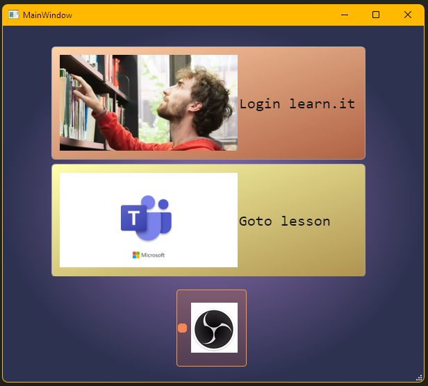

# MrGoto
Software used to automate the process to go to a lesson based on users's schedule and record it 

## This project is part of the rich toolkit [**MrPowerManager**](https://github.com/MrPio/MrPowerManagerClient) wich gives the user a lot of possibility in terms of remote controlling.
***

